# Market for Spider Group
 
>*Преа́мбула: в связи со спецификой условий выполнения задачи, код далее написан исходя из  следующих принципов:*
>   - *Больше, не значит лучше.*
>   - *Сначала функционал, потом оптимизация.*
>   - *Делаешь, как понимаешь.* 
>
>*Подробности специфики не уточняю, однако автор полностью согласен со всей критикой в части, например, оптимизации кода.*

 

## Общее описание.

### Код написан по заданию [Spider Group](https://spider.ru/).

 

**Поставленные задачи:**
- Построить структуру БД используя Django ORM.
- Настроить редактирование этих данных в Django admin.
- Написать API для получения данных из этих моделей используя DjangoRestFramework и django_filters.

**Реализованные сущности:**
- Пользователь (*переопределенная модель Django*)
- Категория
- Компания
- Продукт

**Структура БД согласно задания:**  
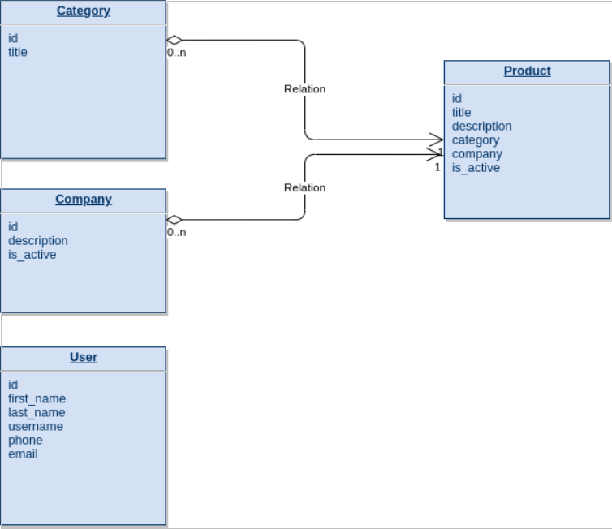

**Разработаны следующие ресурсы API:**

1. Регистрация пользователя;
2. Авторизация пользователя по DRF токену;
3. Список категорий;
4. Список активных компаний;
5. Список активных продуктов, включая: 
    - фильтрация по компании,
    - фильтрация по категории,
    - поиск по неполному наименованию;
6. Детальная карточка продукта;
7. Создание/Изменение/Удаление (*обязательная авторизация*).

 

## 1. Установка. 
 

Для корректной работы вам нужен **Python 3.7 или выше**.

1.1 Скачайте код: 
`git clone https://github.com/Sam1808/SG.git`

1.2 Создайте виртуальное окружение, [активируте](https://devpractice.ru/python-lesson-17-virtual-envs/#p33) его и перейдите в папку `spider_project`: 
`python3 -m venv _название_окружения_`

1.3 Обновите установщик пакетов `pip` (*не помешает*) и установите зависимости: 
`pip install --upgrade pip` 
`pip install -r requirements.txt`

1.4 Примените существующие миграции: 
`python manage.py migrate`

1.5 Создайте суперпользователя (администратора): 
`python manage.py createsuperuser`

1.6 Запустите локальный сервер: 
`python manage.py runserver` 
который будет доступен по адресу 
`http://127.0.0.1:8000/`

1.7. Наслаждайтесь (*обязательное условие*).
  

## 2. Использование

 

### 2.1 Подготовка 

Для того чтобы проверить корректность работы API по пунктам 3-7 (см. *Разработаны следующие ресурсы API*) предлагается вручную добавить объекты сущностей Категория, Компания, Продукты. Заодно убедиться в правильной работе Django admin (см. *Поставленные задачи*).

Для этого... Переходим в раздел администратора 
`http://127.0.0.1:8000/admin/ ` 
Вводим логин/пароль (*см. пункт 1.5*), получаем следующий интерфейс:  
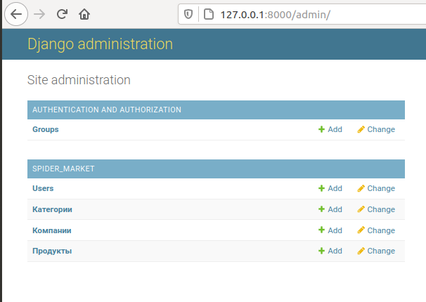  
Введите тестовые данные для каждой из сущностей, например так:   
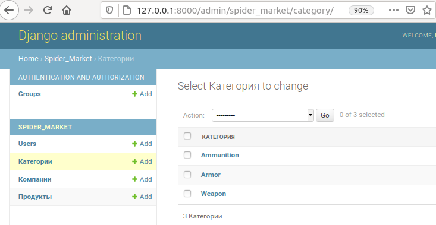 
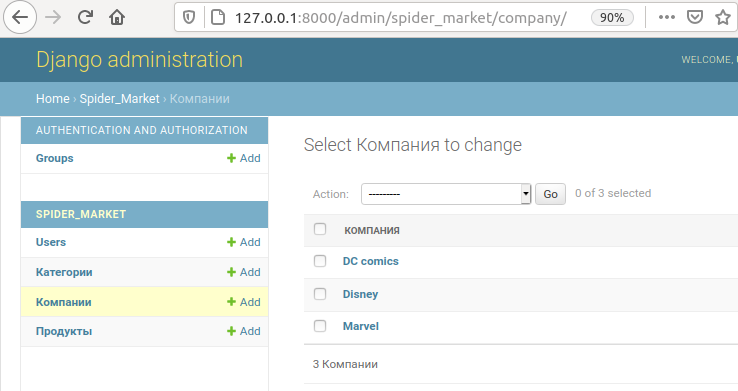 
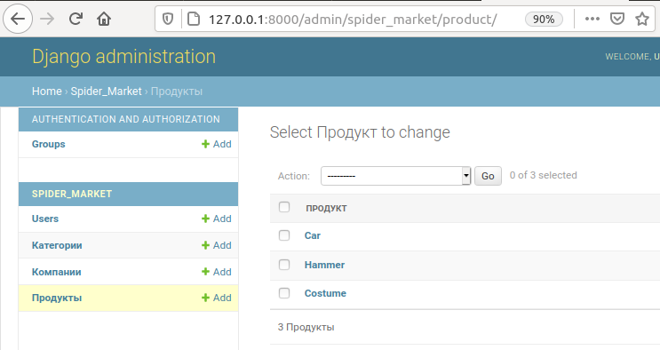 
  

### 2.2 Регистрация пользователя

API регистрации пользователя реализовано через Django Rest Framework (DRF), по ссылке:  
`http://127.0.0.1:8000/registr/ ` 
Получаем следующий API интерфейс:   
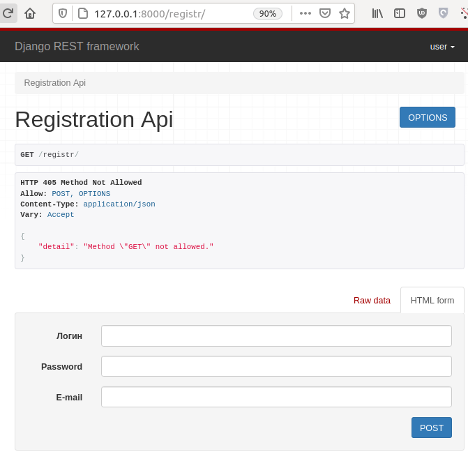 

Реализованы обязательные поля Логина, Пароля и E-mail`а.   
Давайте , например для [Spider Group](https://spider.ru/) создадим настоящего **Spiderman**:   
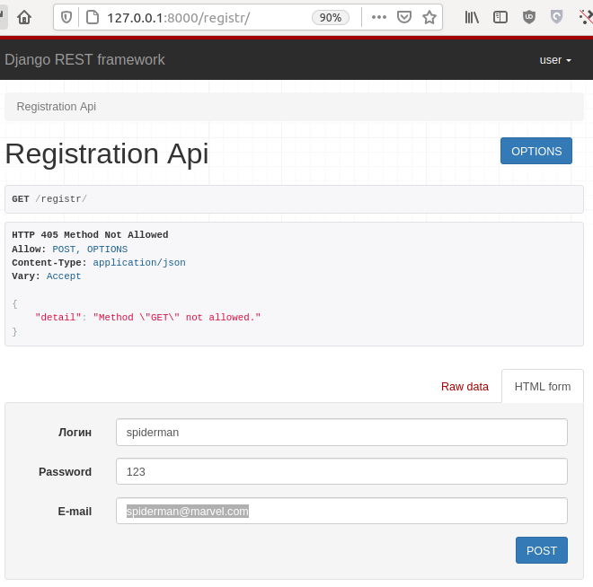  

В случае успешного создания пользователя API возвращает `"response": true`.

 
 
### 2.3 Авторизация пользователя по DRF токену

Авторизация в примерах отражена в пункте **2.8 Создание/Изменение/Удаление**.

Здесь же мы остановимся на создании Токена для пользователя, его проверке и обновлении.

Итак, зарегистрированный пользователь может получить Токен на странице:  
`http://127.0.0.1:8000/auth/jwt/create` 
Для получения Токена необходимо указать Логин и Пароль. 
Получаем токены для **Spiderman`a**:

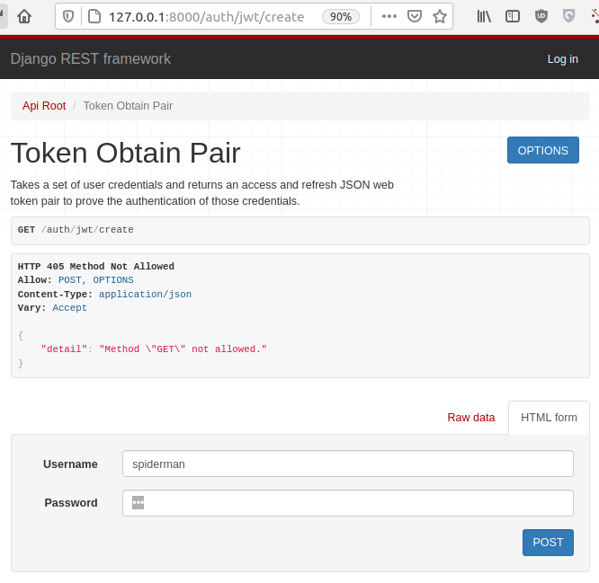  

После, API отдает пользователю Токен авторизации (*access token*) и Токен обновления (*refresh token*). 

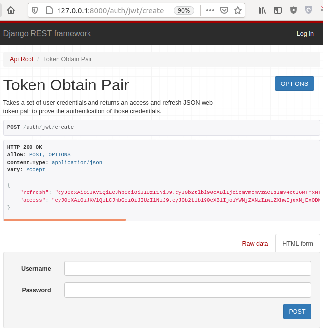  

Доступность Токена проверяется по ссылке: 
`http://127.0.0.1:8000/auth/jwt/verify`  

Обновление Токена: 
`http://127.0.0.1:8000/auth/jwt/refresh`

Использование Токенов реализовано на библиотеке [SimpleJWT](https://github.com/SimpleJWT/django-rest-framework-simplejwt), большинство настроек сохранены по умолчанию.

 

### 2.4 Список категорий
API списка Категорий доступно по ссылке: 
`http://127.0.0.1:8000/categories/`  
Согласно условий - исключительно режим `read only`.

 

### 2.5 Список активных компаний
API списка Компаний доступно по ссылке: 
`http://127.0.0.1:8000/companies/`  
Опять же, исключительно режим `read only`.  Обратите внимание, что в списке только *активные* Компании. Т. об. если на шаге 2.1 при внесении компаний вы не указали *Доступность компании* (по умолчанию значение False), то по запросу к API вы получите пустой список.

 

### 2.6 Список активных продуктов

API списка Продуктов доступно по ссылке: 
`http://127.0.0.1:8000/activeproducts/`  
Традиционно режим `read only` и только продукты с отмеченным флагом *Доступность продукта*.

Реализована фильтрация, согласно задания:
- фильтрация по Компании 
`http://127.0.0.1:8000/activeproducts/?company=id`, где `id` - это `id` компании, продукты которой надо отобразить;
- фильтрация по Категории 
`http://127.0.0.1:8000/activeproducts/?category=id`, где `id` - это `id` конкретной категории продуктов;
- фильтрация по неполному наименованию Продукта;  
`http://127.0.0.1:8000/activeproducts/?title=наименование продукта`

Примеры:
1. Давайте заведем через Django Admin несколько сущеностей Продукт с примерно одинаковым названием, например `test1`, `test2`, `test3`. Некоторые из них должны быть *активными*. Проверим поиск с условиеми *неполного* наименования:  
`http://127.0.0.1:8000/activeproducts/?title=test` 
Получим спискок всех *активных* продуктов, где в имени продукта есть `test`.
2. А ещё фильтры можно использовать совместно. Например, запрос всех продуктов, где в имени есть `test` , категории с id равной 1 и компании с id номер 2, будет выглядить так:  
`http://127.0.0.1:8000/activeproducts/?title=test&category=1&company=2`

 
 

### 2.7 Детальная карточка продукта

API Детальной карточки продукта доступно по ссылке: 
`http://127.0.0.1:8000/product/id`  
Где `id` - это идентификационный номер Продукта, чью детальную карточку вы хотите просмотреть/получить в режиме `read only`.

 

### 2.8 Создание/Изменение/Удаление

Реализовано API Создание/Изменение/Удаление... для сущности "Продукт". Для операций [CRUD](https://ru.wikipedia.org/wiki/CRUD) неоходима авторизация по JWT (*наконец-таки!*). 
При этом "Создание" отделено от "Изменения/Удаления" на разные ресурсы API (*хотите узнать почему - спросите у меня об этом при личной встрече*). 
Далее все процессы будут описаны примерами, для реализации которых используем [Postman](https://www.postman.com/).
  

#### 2.8.1 Создание объекта cущности Продукт при обязательной JWT авторизации.

Для начала выберем пользователя, от чьего имени будем авторизовываться, проверим доступность его Токена и при необходимости обновим его (*все то, что вы делали в пункте 2.2*)

API создания объекта реализовано по ссылке: 
`http://127.0.0.1:8000/createproduct/`  

Для успешной авторизации укажем в интерфейсе [Postman](https://www.postman.com/) легитимный Access Токен выбранного пользователя:  
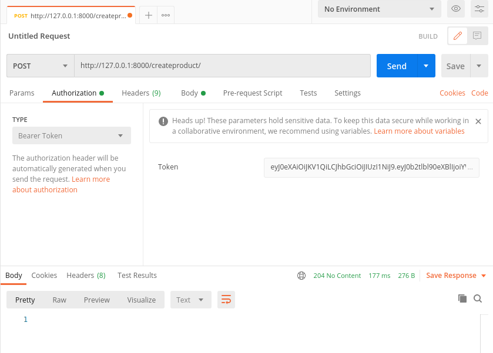  
В теле (*Body*) запроса укажем обязательные поля для создания продукта и отправим запрос `POST`.
Здесь мы сделаем для нашего Spiderman`a паутину "против врагов".  
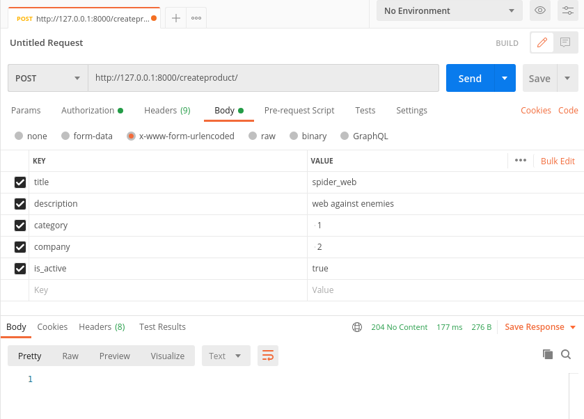  
Если все получилось, то вы увидите ответ сервера в виде только что созданного Продукта.  
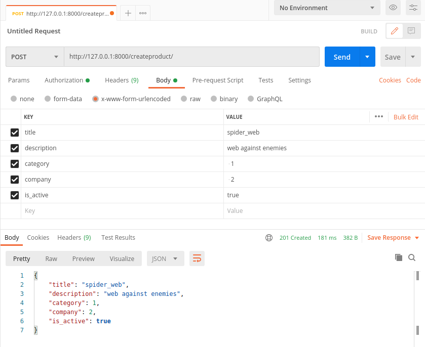  

  

#### 2.8.2 Изменение и Удаление Продукта при обязательной JWT авторизации.

Правила почти те же - легитимный Access Токен. Убедитесь, что он у вас есть и для изменения/удаления карточки Продукта обратитесь по ссылке: 
`http://127.0.0.1:8000/modifyproduct/id`  
Где `id` - это идентификационный номер Продукта, который вы хотите изменить/удалить.  

API позволяет использовать методы `PUT`, `PATCH`, `DELETE` (*и никуда не деться от `GET`*), и если с последним все ясно, то между `PUT` и `PATCH` есть разница, будьте внимательны. 

Подставив свежий Токен, давайте изменим только что созданный Продукт.  
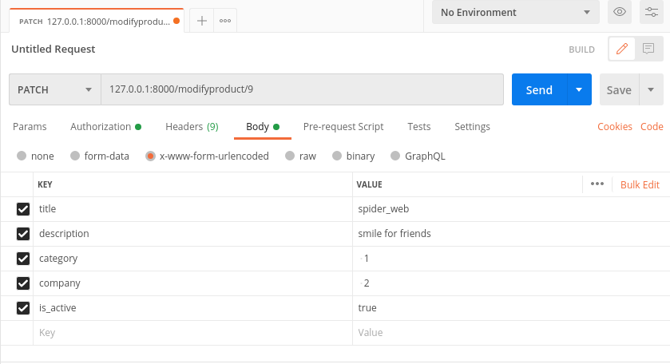  
Поменяли описание и применяем метод `PATCH`. В ответ прийдет измененный продукт:  
  

С удалением тоже никаких проблем. Просто применяем метод `DELETE`. Если пришел пустой ответ, то указанный продукт удален.  
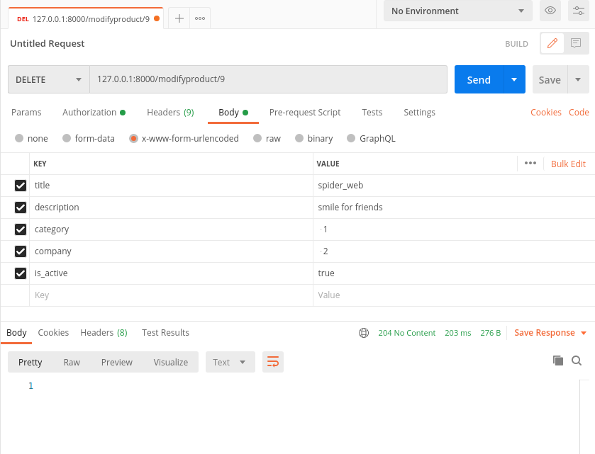  

> Если вы дочитали до конца, и вам понравилось - поставьте *звездочку* репозиторию. 
> Или не ставьте... :)
